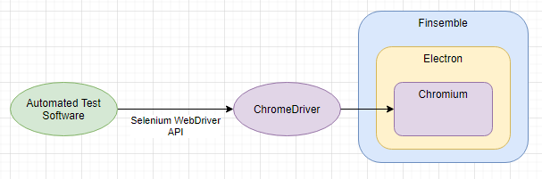
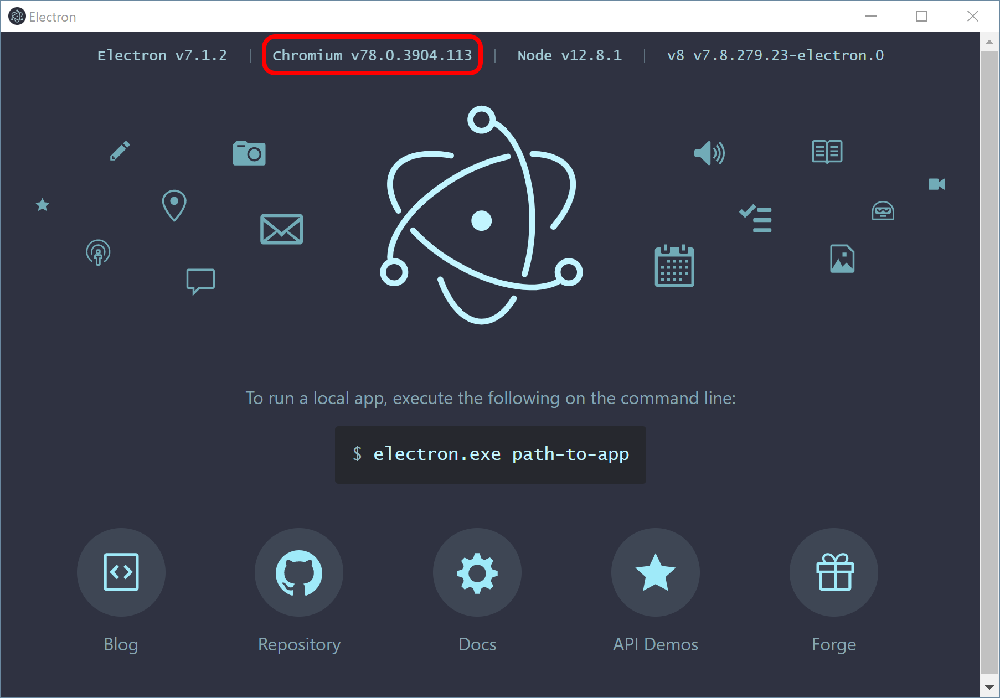

# finsemble-selenium-example
This is a very simple example Python project demonstrating how to integrate Finsemble and Selenium WebDriver for
end-to-end automated testing.

## Pre-requisites
1. Python 3.7
2. The following items added to your `PATH` variable (basic Python dev environment setup):
    1. `%LocalAppData%\Programs\Python\Python37`
    2. `%LocalAppData%\Programs\Python\Python37\Scripts`
    3. `%AppData%\Python\Python37\Scripts`
3. `$ pip install pipenv` for package installation and virtual environment management.
4. A Finsemble application (e.g. `finsemble-seed`) to automate.
5. An appropriate version of ChromeDriver downloaded (see below.)

## Install
```
$ git clone https://github.com/ChartIQ/finsemble-selenium-example.git
$ cd finsemble-selenium-example
$ pipenv install
```

## ChromeDriver
In addition to the example code provided in this repo, you also need an appropriate version of
[ChromeDriver](https://chromedriver.chromium.org/downloads) downloaded onto your machine. ChromeDriver is what actually
connects the automation code (i.e. this repo) to the application-under-test (i.e. Finsemble) via the Selenium API.



### ChromeDriver versioning
The version of ChromeDriver you need to use is highly dependent on the version of the underlying Chromium used in the
application-under-test, which in our case correlates directly with the version of Electron & Finsemble under test. Thus,
in order to download the correct version of ChromeDriver, you need to check the version of Chromium that is in use by
the Electron version in use by Finsemble.

The easiest way to do this is to simply launch the `node_modules/electron/dist/electron.exe` binary located within the
Finsemble application-under-test. (E.g. `finsemble-seed`)

Launching the `electron.exe` binary should result in a screen like the following:



The Chromium version associated with any given version of Electron is displayed at the top - this version is what should
be targeted when deciding on an appropriate version of ChromeDriver to download & use. For example, in the above image,
Chromium v78 is in use, so
[ChromeDriver v78](https://chromedriver.storage.googleapis.com/index.html?path=78.0.3904.105/) would be the proper
version to download & use for automation.

Keep in mind that, each time Electron (and thus, Chromium) is updated within your Finsemble application-under-test, you
will also need to keep ChromeDriver updated to an appropriate version.

## Setting up Finsemble for end-to-end automation
The example code provided in this repo demonstrates how you can automate Finsemble while launching either "from src"
(i.e., similar to how you run Finsemble in a dev environment via `npm run dev`) or "from exe" (i.e., using a
pre-compiled executable that's been installed to the system.)

Regardless of how you wish to launch Finsemble for automated testing, you still need to serve the Finsemble manifest
in order for the application to run.

When building from src, the Finsemble manifest is almost always locally-hosted, so you will need to run the following
command from your Finsemble application-under-test (e.g. `finsemble-seed`), *prior* to starting the automated testing:
```
$ npm run server
```

When launching from an exe, whether or not you need to locally-host depends entirely on how you've configured Finsemble
during the build phase. Executables may need to be locally-hosted in the same way as running from src, but in most
production environments, the exe will be configured to point to some external server.

## Running the automation code
The file `__main__.py` is the main entry-point for this example repo. There are a few lines of code at the very top that
you'll need to change locally:
```python
# [...]
PATH_TO_FINSEMBLE_SEED = "%UserProfile%/Dev/Finsemble/finsemble-seed"
PATH_TO_FINSEMBLE_EXE = "%LocalAppData%/XyzDev/app-1.0.0/XyzDev.exe"

# [...]
PATH_TO_CHROMEDRIVER = "%UserProfile%/Dev/Utils/WebDrivers/chromedriver_78/win32/chromedriver.exe"
```

- `PATH_TO_FINSEMBLE_SEED`: The filepath pointing to the local dev environment of the Finsemble application-under-test 
(e.g. `finsemble-seed`), if you want to run the automation on a Finsemble application that's been built "from src".
  - As described above, the Finsemble manifest still needs to be served before launching any Finsemble automation with
    the example code in this repo. When running Finsemble "from src", you are usually locally-hosting the Finsemble
    server, so ensure that `npm run server` has been run from the application before kicking off any automation.
- `PATH_TO_FINSEMBLE_EXE`: The filepath pointing to the local Finsemble application executable under-test, if you want
to run the automation on a pre-built installed Finsemble standalone executable.
  - NOTE: When a Finsemble application is packaged as a binary, you first get the "installer exe" - this is *not* the
    exe that should be used here. Running the installer exe once will unpack the Finsemble application & the
    actual executable binary elsewhere onto your machine, usually under `%LocalAppData%`, and that is what needs to be
    provided here.
- `PATH_TO_CHROMEDRIVER`: The filepath pointing to the `chromedriver.exe` that is versioned according to the version of
the underlying Electron/Chromium version in use by the Finsemble application-under-test (see above.)

With these variables set, and with the Finsemble manifest being served (either locally or externally), you can run the
`__main__.py` script. You should see Finsemble launch, create a new workspace, launch a Welcome Component, zoom in & out
of that Welcome Component, click the Welcome Component's blue "Launch Docs" button, and then Finsemble will close down.

The `__main__.py` script, and the other supporting scripts are documented with comments, so you should be able to use
this is a jumping-off point to expand to build out automated functionality for your Finsemble application using the
standard Selenium library from here.
